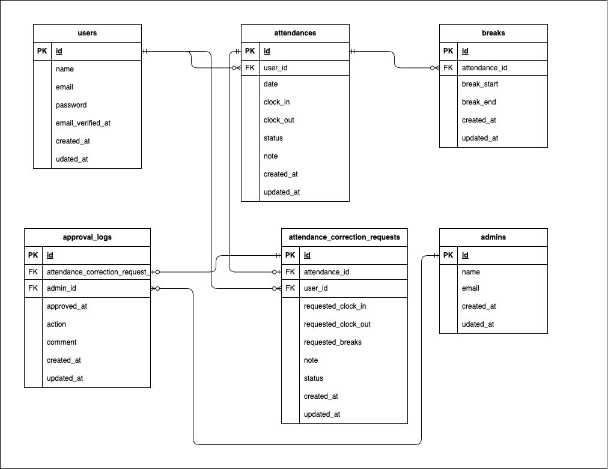

# kintai

## 前提条件
- Gitがインストール済みであること
- DockerおよびDocker Composeがインストール済みであること

## 環境構築

### Clone
```bash
git clone git@github.com:nihil0000/kintai-mock.git .
```

＊ MySQLはOSによって起動しない場合があるため、それぞれのOSに合わせてdocker-compose.ymlファイルを編集してください \
＊ 開発環境がMacOS (Appleチップ) mysql, phpmyadminにて`platform: linux/amd64`を指定しています \
＊ 他のOSでMySQLが起動しない場合
- [Docker公式ドキュメント](https://docs.docker.com/)をご参照ください。

### Build
```bash
make init
```

### Settings
#### .env ファイルを以下のように編集してください。
```bash
DB_HOST=mysql
DB_DATABASE=laravel_db
DB_USERNAME=laravel_user
DB_PASSWORD=laravel_pass

MAIL_FROM_ADDRESS=test@example.com
```

### Migrate, Seed
```bash
docker exec -it [PHP CONTAINER ID] bash
php artisan migrate --seed
```

## 使用技術
- PHP 8.3.19
- Larabel 10.48.29
- MySQL 8.0.26

## ER図


## アクセスURL
- 開発環境
    - http://localhost/login
- phpMyAdmin
    - http://localhost:8080

## テストアカウント
- 一般ユーザ
   - name: general
   - email: general@example.com
   - password: password
- 管理ユーザ
   - name: admin
   - email: admin@example.com
   - password: password

## PHPUnitを利用したテスト
```bash
# Create database
docker compose exec [MYSQL CONTAINER ID] bash
mysql -u root -p # password: root
create database test_database;

# Migrate
docker compose exec [PHP CONTAINER ID] bash
php artisan migrate:fresh --env=testing

# Testing
./vendor/bin/phpunit
```
